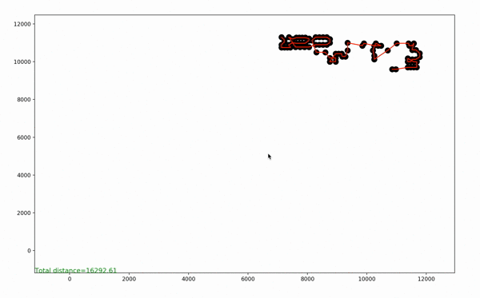
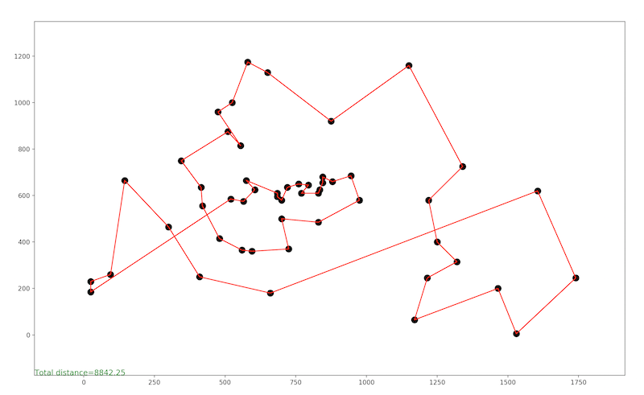

# Tsp

Camilo Andrés Rodríguez Garzón

This is an implementation of the TSP problem, this is solved with a couple of methods such as the nearest neighbor, evolutionary strategy and others method.


Requirements
------------
- [numpy](http://www.numpy.org/)
- [copy](https://docs.python.org/2/library/copy.html)
- [math](https://docs.python.org/2/library/math.html)
- [matplotlib](https://matplotlib.org/)

Install for linux
-------

```
   sudo make install
```

### Testing

The module can test for

`Tsp Pilot with:`
```
   python pilot.py

   python pilot.py pr439.tsp 2 2 10
```
and

`Tsp Nearest Neighbors with:`
```
   python nearestneighbors.py

   python nearestneighbors.py pr439.tsp
```

`Tsp Random Search with:`
```
   python randomsearch.py

   python randomsearch.py pr439.tsp

   python randomsearch.py pr439.tsp 200
```

`Tsp Evolutionary Strategy (1+1) with:`

you can add the following entries to the program with the following order in mind:

* file name
* maximum number of iterations
* maximum proximity of exchange

```
   python evolutionarystrategy.py

   python evolutionarystrategy.py pr439.tsp

   python evolutionarystrategy.py pr439.tsp 200 2
```

`Tsp Simulated Annealing with:`

you can add the following entries to the program with the following order in mind:

* file name
* maximum number of iterations
* temperature
* temperature decrease
* maximum proximity of exchange

```
   python simulatedannealing.py

   python simulatedannealing.py pr439.tsp

   python simulatedannealing.py pr439.tsp 200 100 0.9 3
```

### Examples
```
python nearestneighbors.py
```



```
python evolutionarystrategy.py
```



Run
-------

You can run the basic example you need to use `make` plus the name of the algorithm (`nearest_neighbor`, `pilot`, `random_search`, `evolutionary_strategy` and `simulated_annealing`):

```
   make

   make simulated_annealing
```

References
-----------

*  Vob Stefan, Fink Andreas and Duin Cees (2005) Looking Ahead with the Pilot Method.

*  Kathryn A. Dowsland, Belarmino Adenso Díaz (2003), Heuristic design and fundamentals of the Simulated Annealing
